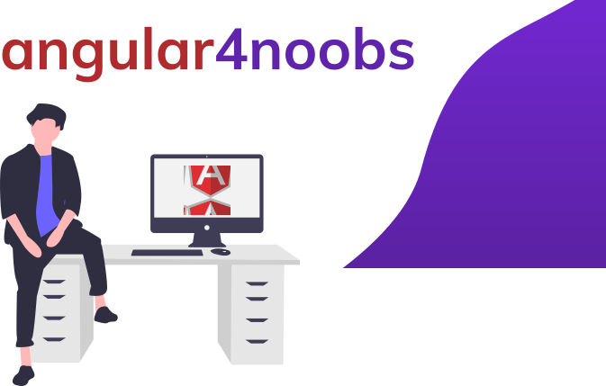

<div align="center">


</div>


### Angular4Noobs desenvolvido para contribuir com a comunidade
**Iniciativa He4rts Developers**
<div align="center">

[](https://opensource.org/licenses/MIT)

</div>

## Introdução
Bem Vindo ao Angular4Noobs, nosso objetivo aqui é te ensinar um pouco do ecossistema do angular
de forma simples, fácil, rápida e descontraída para que você consiga aprender e criar seus próprios projetos e seguir o aprendizado neste incrível framework.

##### Vamos Assumir que voce ja entende um pouco sobre HTML, CSS e Javascript
os exemplos serao escritos com typescript, porem voce pode escrever tudo utilizando javascript normalmente
caso voce ja saiba e queria nos dar alguma opiniao ou algo do tipo, fique a vontade para sugerir nas issues.


## O que e Angular
 Angular e um framework javascript para desenvolvimento de single page applications utilizando typepscript, mas WIL, o que e um framework? eu te digo, um framework e basicamente uma estrutura que vai te da coisas prontas pra facilitar tua vida na hora de desenvolver alguma aplicacao, no caso do angular, ele te da todo um ecossistema para desenvolvimento que se voce seguir voce consegue desenvolver algo.

mas enfim, o que ele me oferece wil? entao... o angular te oferece coisas como


##  O que vamos aprender
Esse Angular4Noobs vamos fazer entender os conceitos teoricamente e depois aplicar no projeto que será uma calculadora de valor para freelancer, faremos isso para fixar os conceitos e aprender bem na prática como é usar o angular.

1. [ Angular CLI](https://github.com/WilHolt/angular4noobs/blob/master/conteudos/angular-cli.md)
2. [ Componentes](https://github.com)
7. [ Diretivas](https://github.com)
8. [ Serviços](https://github.com)
8. [ Manipulacao Dados](https://github.com)
8. [ Formularios](https://github.com)
8. [ Rotas](https://github.com)
5. [ Estrutura de Projetos](https://github.com)
6. [ Estrutura dos Arquivos ](https://github.com)
7. [ Ciclos de Vida ](https://github.com)
5. [ Começando o Projeto ](https://github.com)

# Comecando o Projeto

Bom, nos vamos criar um pequeno blog para aplicar o que vai ser ensinado aqui, vamos la?
## Configurar Ambiente
Bom, para começar, você vai primeiramente necessitar dos seguintes arquivos:

1. Node JS
    * [Acesse o site Oficial](https://nodejs.org/en/)
2. NPM (ou qualquer outro gerenciador de pacotes de sua preferencia )
2. Angular CLI
    ```console 
     npm install -g  @angular/cli
     ```
3. Qualquer Editor de sua preferencia ( no caso vou usar o VSCode )
    * [Acesse o site Oficial](https://code.visualstudio.com)


# Quero Contribuir

Deseja contribuir com a comunidade open source e com esse projeto maravilhoso para ajudar mais e mais pessoas? nós apreciamos muito sua atitude!
segue os passos abaixo e seja feliz (:

1. Realize um Fork do projeto
2. Crie um branch com a nova feature (git checkout -b  feature/featureBraba)
4. Realize o Commit (git commit -m 'Adicionado 5. conteudo brabo')
5. Realize o Push no Branch (git push origin feature/featureBraba)
6. Abra um Pull Request
7. Aguarde a Review e Voilá

## Autores

Jose Wilder [Linkedin](http://linkedin.com/in/jose-wilder)
